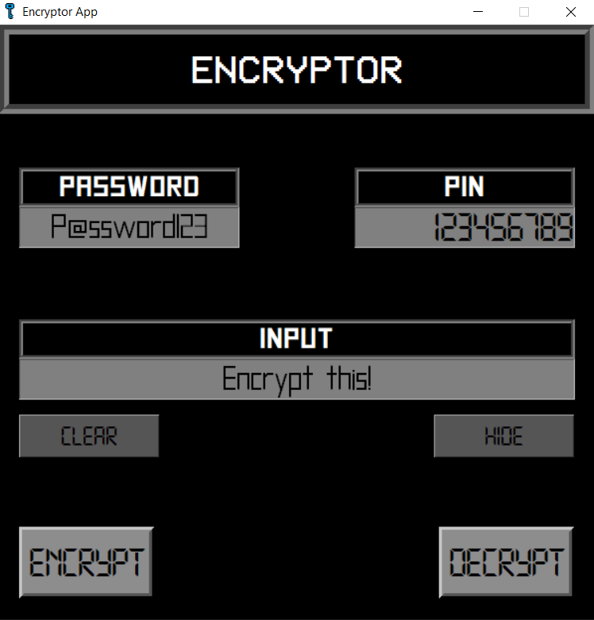
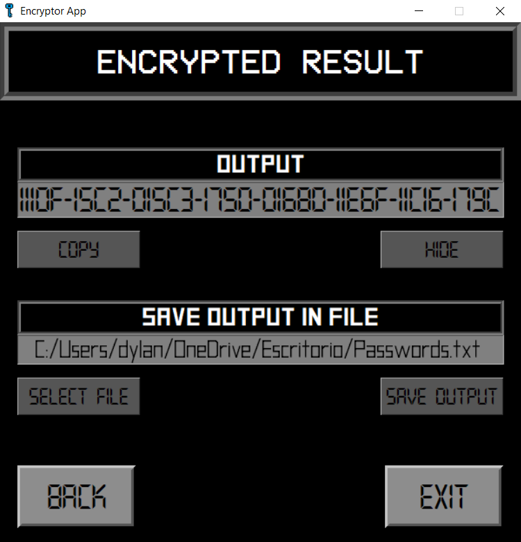

# Encryptor App
The application to securely store your passwords on your computer.
  

## _What is the idea of this application?_
This application is meant to provide a safe way to store your important passwords on your computer, in order to facilitate having an unique and secure password for each website, application, etc.
  

## _How does it work?_
***Encryptor*** requires 3 inputs for encrypting & decrypting: 
- Password
- PIN
- Text to encrypt or decrypt

This _password_ and _PIN_ **should not** be stored in your computer, but on a piece of paper or in your mind!
   

# App GUI

   

